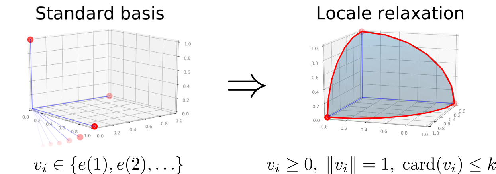

# SDP Clustering • [![PyPi][pypi-image]][pypi] [![colab][colab-image]][colab] [![License][license-image]][license] 

[license-image]: https://img.shields.io/badge/License-MIT-yellow.svg
[license]: LICENSE

[pypi-image]: https://img.shields.io/pypi/v/sdp-clustering.svg
[pypi]: https://pypi.python.org/pypi/satnet

[colab-image]: https://colab.research.google.com/assets/colab-badge.svg
[colab]: https://colab.research.google.com/drive/16d06iAViZHJ58S-RmwAzKR_TyWi5FE-V#offline=true&sandboxMode=true

* Community detection using fast low-cardinality semidefinite programming *

This repository contains the source code to reproduce the experiments in the NeurIPS'20 paper [Community detection using fast low-cardinality semidefinite programming](https://arxiv.org/abs/2012.02676) by [Po-Wei Wang](https://powei.tw/) and [J. Zico Kolter](http://zicokolter.com/).

## What the package provides
It detect communities (that is, clustering with unknown number of clusters) via maximizing a metric called modularity.
Further, it provides sparse embeddings for nodes in a graph.

#### How it works
We relax the (combinatorial) modularity maximization problem to a smooth semidefinite program (SDP) by converting the Kronecker delta into a dot-product.
By further controlling the cardinality (sparsity) in the dot-product space, 
we develop a efficient optimization algorithm that scales linearly with the number of data entries. See the paper for more details.


## Installation

### Via pip
```bash
pip install sdp-clustering
```

### From source
```bash
git clone --recursive https://github.com/locuslab/sdp_clustering
cd sdp_clustering && python setup.py install
```

#### Package Dependencies
```
conda install -c numpy scipy
```

## Running experiments
After installation, the package provides a command-line utility **locale_alg** accepting matrix-market format.
For example, to detect communities in Zachary Karate Club and output the result in *labels.txt*, run
```bash
locale_alg data/zachary.mtx --out labels.txt
```
To obtain the low-cardinality embedding (without rounding) with cardinality ≤2, run
```bash
locale_alg data/zachary.mtx --out emb.txt --embedding --k=2
```

### Experiment parameters
All experiments can be replicated by the default parameters (k=8), except that the Amazon data requires k=16.

## API
See **bin/locale_alg** for the example usage.
Mainly, the package provides 3 functions
```python
locale_embedding: obtain embeddings from the continuous optimization algorithm 
leiden_locale:    obtain comminity assignments by the hierarchical Leiden-Locale algorithm
init_random_seed: set random seed
```
For more details, see *sdp_clustering/models.py*.
For even more details, see the Cpp implementation in the *src/* folder.
